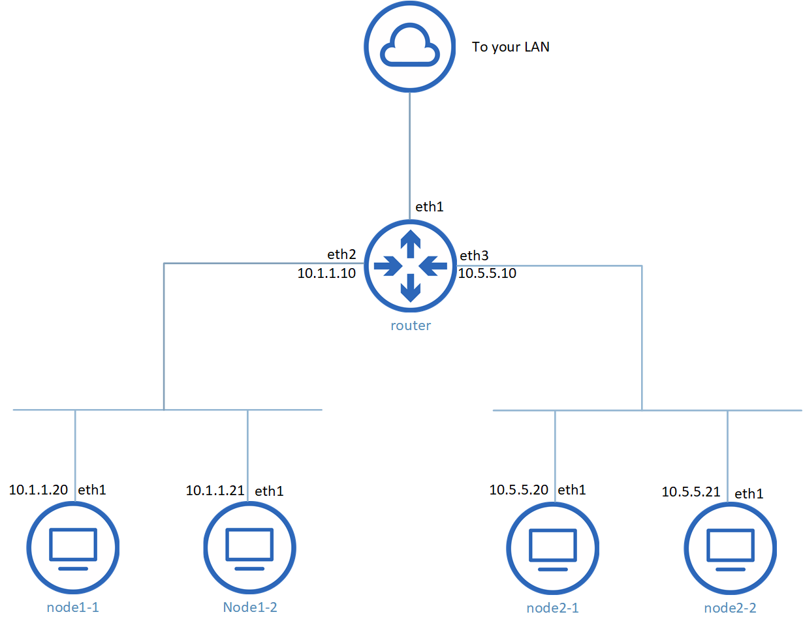

# vagrant-labs

The purpose of these labs is to speed up the creation of the environment for testing various Linux server capabilities.

## d2-lab

This lab is based on the "ddd-lab" but instead of using only just DHCP functionality of Kea, it builds DHCP/DDNS server (also known as D2) for dynamic DNS updates to BIND. Also, it does not include Directory Services.

* In order for this lab to work properly you must disable DHCP server in a VirtualBox private network associated with this lab

## ddd-lab

This lab sets up DHCP and DNS servers with some basic configurations along with a couple of clients. Additionally it installs several packages like vim and tshark for testing and experimenting purposes.
Also, I'm planning on adding Directory Services into this environment (hence the name "ddd").

* In order for this lab to work properly you must disable DHCP server in a VirtualBox private network associated with this lab

## docker-lab

At the moment this lab only installs Docker and a few other packages on a CentOS guest. Will expand on it in the future.

## linux-router-lab

This lab is intended for testing firewalld and Linux packet forwarding.  
It creates several clients connected to VirtualBox internal network and a Linux router interconnecting all those clients. The router has a public facing interface and the only way for clients to access Internet is going through that router (check network diagramm below), but there is no default gateway and NAT settings in place so that's not going to work out of the box. I didn't include those settings in Vagrant file on purpose to be able to input them manually for practice, but it may change in further iterations of this lab.


## Prerequisites

* Vagrant 2.2.16 or higher
* VirtualBox 6.1.22 or higher
* Internet connection for pulling boxes from Vagrant Cloud

## Basic usage

```
git clone https://github.com/alex4lbin/vagrant-labs.git
cd vagrant-labs/ddd-lab
vagrant up
```
